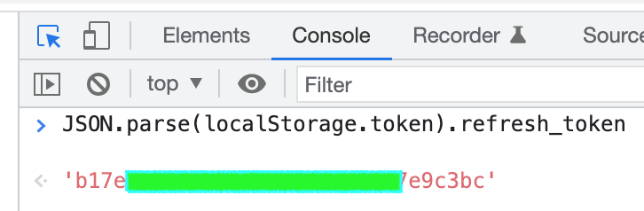
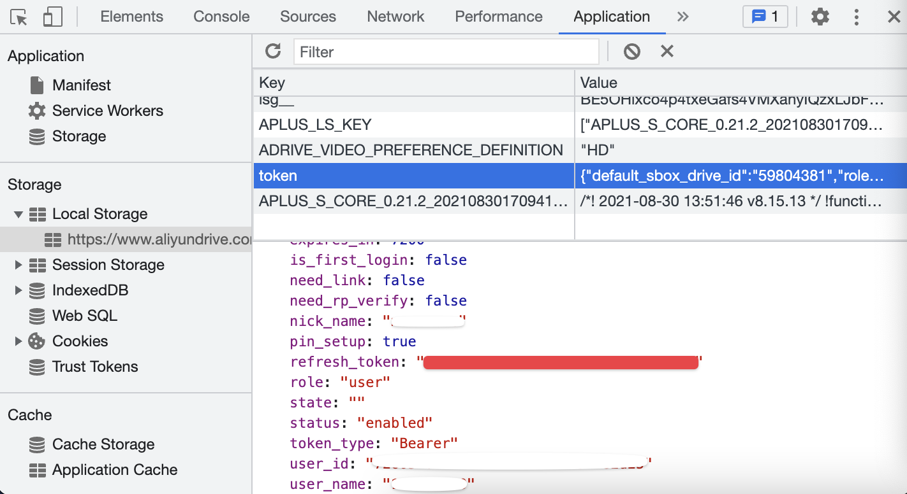

<h1 align="center">阿里云盘每日签到</h1>
<h4 align="center">支持 GitHub Action , 无需服务器即可实现每日自动签到</h4>

> 基于 Node.js 通过 GitHub Actions 实现阿里云盘自动签到获取奖励功能

### 功能

| 功能        | 是否支持 | 未来计划 |
|-----------|:----:|:----:|
| 签到        |  ✅   |  -   |
| 签到推送      |  -   |  ✅   |
| 多账户       |  ✅   |  -   |
| Action 签到 |  ✅   |  -   |

### 使用
#### 第一步：右上角Fork该项目
#### 第二步：获取 refresh_token

##### 1.自动获取: 
登录[阿里云盘](https://www.aliyundrive.com/drive/)后，控制台粘贴 `JSON.parse(localStorage.token).refresh_token`

##### 2.手动获取: 
登录[阿里云盘](https://www.aliyundrive.com/drive/)后，可以在开发者工具 ->Application -> Local Storage 中的 `token` 字段中找到。  

**注意：不是复制整段 JSON 值，而是 JSON 里 `refresh_token` 字段的值，如下图所示红色部分：**
  

#### 第三步：添加环境变量
在仓库的 `Settings` - `Secrets and variables` - `Actions` - `New repository secret` 添加上面获取的 `refresh_token`

**注意：多个账户时使用英文逗号分割 `refresh_token`**

#### 第四步：点击仓库 Actions，如图：

### 注意

- 无法自动更新 refresh token, 可能存在运行数天后鉴权失败的情况, 需要手动更新
- 如有提出 Issues 的必要, 请尽量提供报错截图, 错误情况, 以及尝试过的解决方案。
